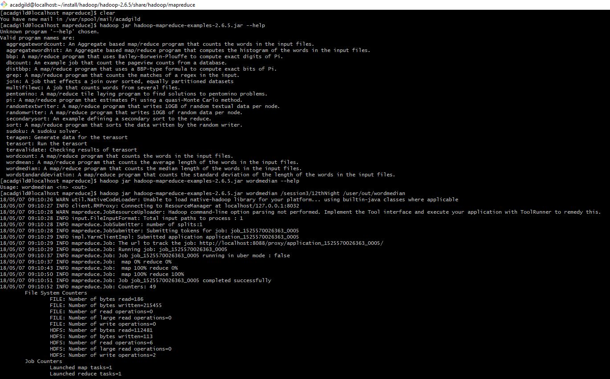
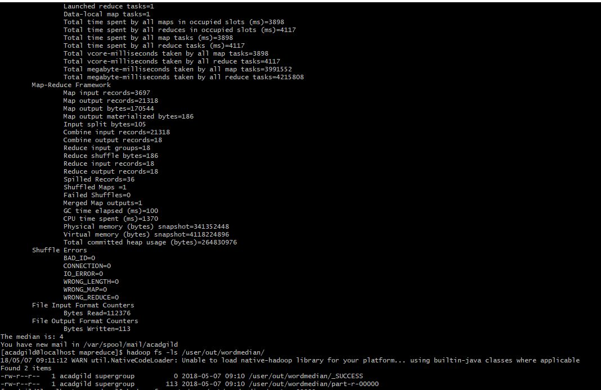
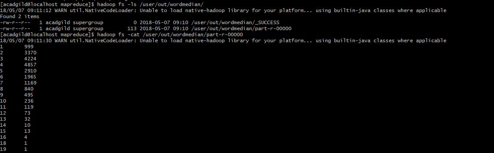
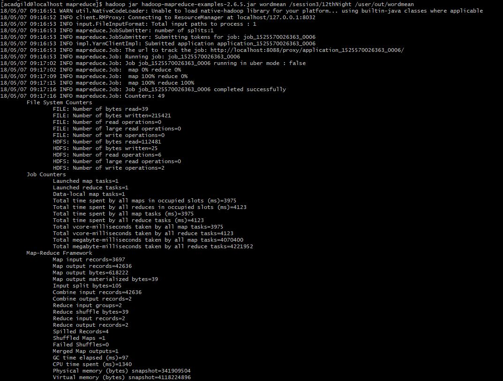
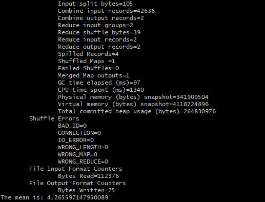
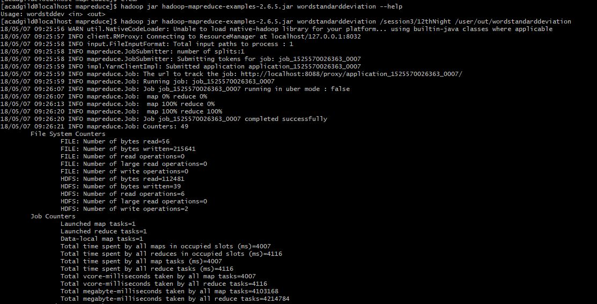
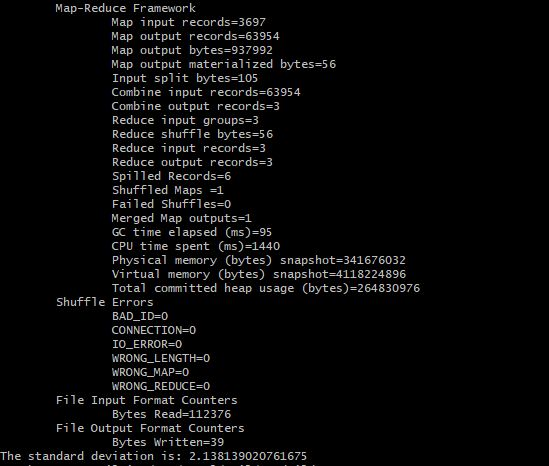

# Session 3:  Assignment 1
## Task 1
## Word Median
### First we review the available examples using a simple help command.  Then we execute the jar file on an input file containing Shakespeare's 12th Night.

### The program output indicates that the median is 4

### The output file (part-r-00000) can be reviewed as well to see the number of words counted for specific word lengths

## Word Mean
### Executing the jar example to discover the word mean

### The word mean on Shakespeare's 12th Night is 4.26559714...

## Word Standard Deviation
### Performing the Standard Deviation Example

### The Standard Deviaton ends up being 2.13813902...

